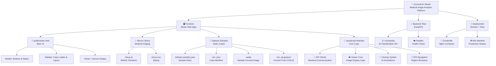

# 🏥 **Cervical AI Viewer - Complete Project Report**

## **🎯 Project Overview**
This is a **medical image analysis platform** specifically designed for **cervical cancer screening** using AI-powered classification. It's a web-based viewer that can display cervical cytology images and overlay AI-detected abnormalities.

## **🏗️ System Architecture**



---

## **📁 Project Structure Analysis**

### **🔧 Root Configuration Files**

#### **📋 README.md**
- **Purpose**: Project documentation and setup instructions
- **Key Info**:
  - Classification-only demo scope
  - Uses Niivue for medical imaging
  - Instructions for running locally and pointing to APIs

#### **🐳 Dockerfile**
- **Purpose**: Production containerization
- **Function**: Creates nginx-based container serving static files
- **Usage**: `docker build -t cervical-viewer .`

#### **⚙️ nginx.conf**
- **Purpose**: Web server configuration for production
- **Features**: CORS headers, SPA routing, static file serving

#### **🚫 .gitignore**
- **Purpose**: Excludes build artifacts, dependencies, system files

---

### **🖥️ Frontend (`public/` directory)**

#### **📄 public/index.html** - Main Application UI
```html
Structure:
├── Header: Navigation & Controls
├── Sidebar: Case Management & Layer Controls
└── Viewer: Canvas-based Image Display
```

**🎛️ UI Components:**
- **Header Bar**: Buttons, status indicator, loading spinner
- **Sidebar**: Case URL input, layer toggles
- **Main Viewer**: WebGL + Canvas overlay system

#### **🎨 Niivue Library (`public/niivue/`)**
- **niivue.js** : Medical imaging WebGL library
- **niivue.css** : Medical viewer styling
- **Purpose**: Handles medical image formats (NIfTI, DICOM, etc.)

#### **🖼️ Assets (`public/images/`)**
- **`<id>.webp`**: Dataset-backed sample cervical cytology slides (lossless WebP)
- **Purpose**: Static demo images for local + Cloudflare Pages hosting

#### **📊 Case Data (`public/cases/`)**

**🗂️ cric-<id>.json** - Dataset Sample Case Configuration
```json
{
  "case_id": "CRIC-<id>",
  "slides": [{
    "slide_id": "CRIC-<id>",
    "uri": "images/<id>.webp",
    "layers": [
      {"layer_id": "gt-boxes", "geometry": "polygons", "uri": "cases/cric-<id>-gt.geojson"}
    ]
  }]
}
```

**📦 cric-<id>-gt.geojson** - Ground-truth boxes (GeoJSON)
- **Source**: Converted from YOLO label files (`.txt` normalized xywh) into polygon rectangles.
- **Properties**: Each feature includes `label` (Bethesda class) and `class_id`.

**🤖 classify.json** - Optional mock classification response (only used if `window.__ENV__.USE_MOCK=true`)
- **Format**: Bounding boxes with labels and confidence scores
- **Purpose**: Simulates real AI classification API response

---

### **🧠 JavaScript Modules (`public/src/` directory)**

#### **🔌 API Layer (`public/src/api/`)**

**📡 cqaiClient.js** - Asset URL resolution
```javascript
Functions:
├── resolveUri() - Handles mock vs production URLs
```

**🤖 classifyClient.js** - AI Classification API
```javascript
Functions:
├── classify() - Triggers AI analysis
├── Mock mode: Returns local JSON
└── API mode: POST to /v1/classify
```

#### **👁️ Viewer Core (`public/src/viewer/`)**

**🎮 index.js** - Main Application Logic
```javascript
Core Features:
├── 🖼️ Image Display (Canvas + Niivue hybrid)
├── 📥 Drag & Drop Support
├── 🎯 Overlay Management (layers, ROIs)
├── 🔄 State Management (caching, visibility)
├── 🎛️ UI Event Handling
└── 🔄 Loading & Error States
```

**🎨 overlayAdapters.js** - Visualization System
```javascript
Capabilities:
├── 🎨 Color coding by classification type
├── 📐 GeoJSON rendering (points, polygons)
├── 🏷️ Labeled bounding boxes
├── 🎯 Transform calculations (zoom, pan)
└── 📊 Score formatting (percentages)
```

**🧭 roiNav.js** - Region of Interest Navigation
```javascript
Features:
├── 🔍 ROI extraction from polygons
├── 📍 Bounding box calculations
├── 🎯 Center point computation
└── 🔄 Navigation utilities
```

---

### **🔧 Backend (`backend-stub/` directory)**

#### **🐍 main.py** - FastAPI Classification Service
```python
Endpoints:
├── POST /v1/classify - AI classification endpoint
├── GET /healthz - Health check
└── Mock responses with bounding boxes
```

**📦 Requirements & Deployment:**
- **requirements.txt**: FastAPI, Uvicorn, Pydantic dependencies
- **Dockerfile**: Python container setup

---

### **🚀 Deployment (`deploy/` directory)**

#### **☸️ k8s/deploy.yaml** - Kubernetes Manifest
```yaml
Resources:
├── 🚀 Deployment: Nginx container
├── 🌐 Service: Internal networking
└── 🔗 Ingress: External access
```

---

## **🎮 Demo Walkthrough & Button Functions**

### **🚀 Application Startup**
1. **Loads**: `public/index.html` with Niivue library
2. **Initializes**: Canvas system, drag-and-drop, event listeners
3. **Auto-loads**: First dataset sample from `public/cases/dataset-samples.json` (if present)
4. **Displays**: Cervical cytology image with overlay layers

### **🎛️ Button Functions Explained**

#### **🧪 Dataset Sample Buttons (Sidebar)**
- **Function**: Loads a dataset-backed case manifest from `public/cases/`
- **Process**:
  1. Fetches `public/cases/cric-<id>.json`
  2. Loads `public/images/<id>.webp`
  3. Optionally loads ground-truth boxes `public/cases/cric-<id>-gt.geojson`
- **Result**: Reproducible sample cases with known Bethesda labels

#### **🤖 "Classify"**
- **Function**: Triggers AI classification analysis
- **Process**:
  1. Calls classification API (mock or real)
  2. Receives bounding boxes with labels/scores
  3. Draws labeled boxes over image
  4. Updates status to "classified"
- **Mock Data**: Returns HSIL-like (92%) and Artifact (65%) detections

#### **⬅️ "◀ Prev ROI" / "Next ROI ▶"**
- **Function**: Navigate between regions of interest
- **Process**:
  1. Cycles through detected rectangular regions
  2. Highlights current ROI with green border
  3. Updates status with ROI count (e.g., "ROI 2/3")
- **Purpose**: Detailed examination of specific areas

#### **📂 "Load Image from Computer" (Sidebar)**
- **Function**: Load a local image (PNG/JPG/WebP) via file picker (or drag-and-drop)
- **Use Cases**: Ad-hoc inspection and local classification without any backend

### **🎚️ Layer Controls (Sidebar)**
- **ground-truth**: Toggle dataset ground-truth boxes (labeled with Bethesda classes)
- **ai-detections**: Toggle AI model detections
- **user-drawn-rois**: Toggle manual ROIs (rectangles)
- **Purpose**: Show/hide different overlays

### **📥 Drag & Drop Functionality**
- **Function**: Drop any image file onto canvas
- **Process**:
  1. Validates image format (PNG, JPG, etc.)
  2. Clears existing content
  3. Displays new image with proper scaling
  4. Enables classification on dropped image
- **Visual Feedback**: Cyan border highlight during drag

---

## **🔄 Data Flow Architecture**

```
User Action → UI Event → API Call → Data Processing → Canvas Rendering
     ↓              ↓           ↓            ↓              ↓
Load Sample → fetch(case json) → public/cases/*.json → Layer Loading → Image Display
Classify → classify() → /v1/classify → Bounding Boxes → Overlay Drawing
Drop Image → FileReader → Image Processing → Canvas Update → Layer Reset
```

---

## **🎯 What Needs to be Done**

### **🔧 Current Issues to Fix**
1. **🔄 Spinner Bug**: Loading indicator not hiding properly (debugging added)
2. **🎨 UI Polish**: Better error states, loading feedback

### **🚀 Production Readiness**
1. **🔌 Real API Integration**: Replace mock with actual AI service
2. **🔐 Authentication**: User login, session management
3. **📊 Case Management**: Database integration, patient records
4. **🏥 DICOM Support**: Medical imaging standards compliance
5. **📋 Reporting**: PDF reports, annotations export

### **✨ Feature Enhancements**
1. **🔍 Zoom/Pan Controls**: Better image navigation
2. **📏 Measurement Tools**: Distance, area calculations
3. **✏️ Manual Annotations**: Doctor markup capabilities
4. **📈 Analytics Dashboard**: Classification statistics
5. **🔄 Batch Processing**: Multiple slide analysis

### **🏗️ Architecture Improvements**
1. **⚡ Performance**: Image caching, lazy loading
2. **🧪 Testing**: Unit tests, E2E testing
3. **📚 Documentation**: API docs, user guides
4. **🔍 Monitoring**: Error tracking, usage analytics

---

## **🚀 Getting Started**

### **Development Setup**
```bash
# Clone repository
git clone <repository-url>
cd agentic-cervical-screener

# Start development server
python3 -m http.server 8080

# Open browser
open http://localhost:8080/public
```

### **Production Deployment**
```bash
# Build Docker image
docker build -t cervical-ai-viewer .

# Deploy to Kubernetes
kubectl apply -f deploy/k8s/deploy.yaml
```

### **Backend API Setup**
```bash
# Start FastAPI backend
cd backend-stub
pip install -r requirements.txt
uvicorn main:app --host 0.0.0.0 --port 8000

# Configure frontend to use API
# Add to public/index.html before module script:
# <script>window.__ENV__={API_BASE:'http://localhost:8000'}</script>
```

---

## **📊 Technical Specifications**

### **Frontend Stack**
- **Core**: Vanilla JavaScript ES6+ modules
- **Rendering**: Niivue WebGL + HTML5 Canvas
- **Styling**: CSS3 with system fonts
- **Format Support**: PNG, JPG, NIfTI, DICOM (via Niivue)

### **Backend Stack**
- **Framework**: FastAPI (Python)
- **API**: REST with JSON responses
- **Deployment**: Docker + Kubernetes
- **Web Server**: Nginx (production)

### **Data Formats**
- **Images**: PNG, JPG, NIfTI, DICOM
- **Overlays**: GeoJSON (points, polygons)
- **Configuration**: JSON schemas
- **Classification**: Bounding boxes with confidence scores

---

## **🏥 Medical Use Cases**

### **Primary Applications**
1. **Cervical Cancer Screening**: Pap smear analysis
2. **AI-Assisted Diagnosis**: Automated abnormality detection
3. **Quality Assurance**: Second opinion validation
4. **Research**: Dataset analysis and annotation
5. **Training**: Medical education and simulation

### **Clinical Workflow Integration**
1. **Image Acquisition**: Digital microscopy slides
2. **AI Processing**: Automated classification
3. **Review**: Pathologist examination with AI overlay
4. **Reporting**: Structured diagnostic reports
5. **Archive**: Case storage and retrieval

---

This is a **sophisticated medical imaging platform** with a solid foundation for cervical cancer screening workflows! 🏥✨

---
